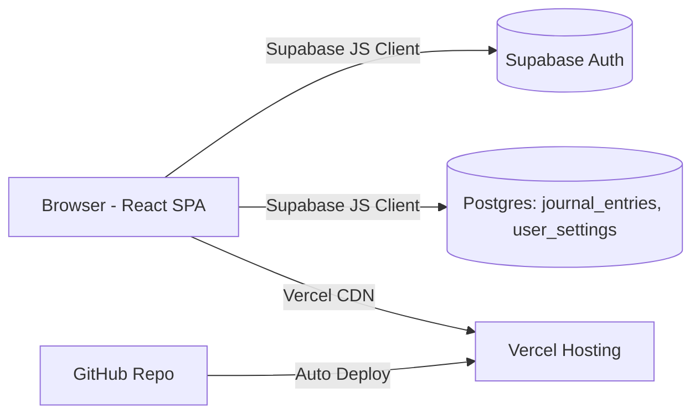
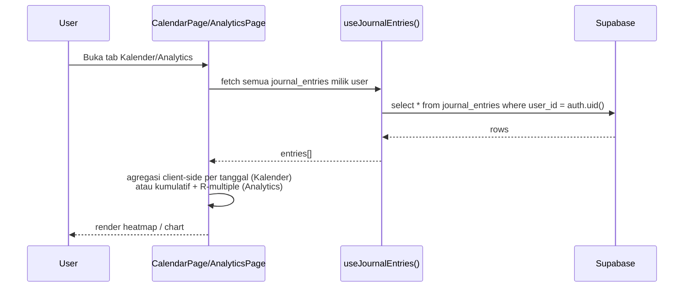

# Trading Compass — Technical Design Document

**Versi:** 1.3 — token warna final hasil audit kontras WCAG (§5.1) dan spesifikasi header keamanan (§8.1) untuk rilis publik.
**Pasangan dokumen:** `trading-compass-requirements.md`
**Catatan:** Dokumen ini tool-agnostic — dipakai sebagai referensi/prompt awal untuk agent AI apa pun (Antigravity, dll.), bukan format spesifik satu tool.

---

## 1. Ringkasan Arsitektur

Single Page Application (SPA) React yang berkomunikasi langsung ke Supabase (Postgres + Auth + RLS) dari sisi client — tanpa backend server terpisah, sama seperti pola aplikasi lama, hanya kali ini terstruktur sebagai proyek multi-file yang proper alih-alih satu file HTML.



## 2. Tech Stack & Alasan Pemilihan

| Layer | Pilihan | Alasan |
|---|---|---|
| Framework | **React** (versi bawaan template Vite saat scaffold — jangan di-downgrade) | Sesuai keputusan Anda |
| Build tool | **Vite** ✅ dikonfirmasi | Standar modern untuk SPA React baru, setup minim, cepat, kompatibel dengan Vercel tanpa konfigurasi tambahan |
| Styling | **Tailwind CSS v4** ✅ dikonfirmasi | Konfigurasi CSS-first (bukan `tailwind.config.js` ala v3) — plugin `@tailwindcss/vite` di `vite.config.js`, token warna (violet, sage, brick, dll.) didefinisikan lewat `@theme { }` di `tokens.css`, dark mode lewat `@custom-variant dark` + toggle class `.dark` di `<html>` |
| Charting | **Recharts** ✅ dikonfirmasi | Library chart React paling umum & ringan, cocok untuk equity curve (LineChart) dan distribusi R:R (BarChart) |
| Icon | **lucide-react** ✅ dikonfirmasi | Ringan, gaya garis tipis yang cocok untuk tampilan data-app profesional, simple & fungsional |
| Routing | **react-router-dom** (default saya; boleh dicoret saat review plan) | Sidebar 5 halaman perlu URL per halaman + tombol Back browser berfungsi. Wajib `vercel.json` rewrite ke `index.html` agar refresh di URL non-root tidak 404 |
| Unit test | **Vitest** (devDependency) | Untuk menguji `riskCalculations.js` & `analyticsCalculations.js` (regression formula kalkulator); jalan native di Vite |
| Backend | **Supabase** (project baru) via `@supabase/supabase-js` | Sesuai keputusan Anda — Auth + Postgres + RLS. Client memakai **publishable key** (`sb_publishable_...`), bukan key `anon` lama |
| Hosting | **Vercel** | Sesuai keputusan Anda, auto-deploy dari GitHub |
| State management | **React Context + custom hooks** | Skala aplikasi kecil–menengah, Redux/Zustand berlebihan untuk kebutuhan ini |

## 3. Struktur Folder Proyek

```
trading-compass/
├─ src/
│  ├─ components/
│  │  ├─ ui/              # Button, Card, Tag, Modal, StatCard, RingGauge, EmptyState
│  │  └─ layout/          # AppShell, SidebarNav, TopBar, ThemeToggle, LangToggle
│  ├─ pages/
│  │  ├─ AuthPage.jsx
│  │  ├─ DashboardPage.jsx
│  │  ├─ CalculatorPage.jsx
│  │  ├─ JournalPage.jsx
│  │  ├─ CalendarPage.jsx     # BARU
│  │  └─ AnalyticsPage.jsx    # BARU
│  ├─ context/
│  │  ├─ AuthContext.jsx
│  │  ├─ ThemeContext.jsx
│  │  ├─ LanguageContext.jsx
│  │  └─ JournalContext.jsx     # data jurnal dimuat sekali, dipakai bersama Jurnal/Dashboard/Kalender/Analytics
│  ├─ hooks/
│  │  ├─ useJournalEntries.js
│  │  └─ useUserSettings.js
│  ├─ lib/
│  │  ├─ supabaseClient.js
│  │  ├─ riskCalculations.js   # murni fungsi kalkulasi, terpisah dari UI → mudah di-unit-test
│  │  ├─ analyticsCalculations.js
│  │  └─ i18n.js
│  ├─ styles/
│  │  └─ tokens.css        # :root/.dark (nilai per tema) + @theme { ... } — token warna & tipografi
│  ├─ index.css            # @import "tailwindcss"; @import "./styles/tokens.css"; @custom-variant dark(...)
│  ├─ App.jsx
│  └─ main.jsx
├─ public/
├─ .env.example
├─ package.json
└─ vite.config.js
```

## 4. Skema Data (Supabase — Project Baru)

### 4.1 Tabel `journal_entries`

```sql
create table journal_entries (
  id bigint generated always as identity primary key,
  user_id uuid not null references auth.users(id) on delete cascade,
  trade_date date not null,                          -- FIX: dulu string toLocaleDateString, sekarang tipe date asli
  instrument text not null,                           -- dulu 'instrumen'
  direction text not null check (direction in ('buy','sell')),  -- dulu 'arah'
  entry_price numeric,
  sl_price numeric,
  exit_price numeric,
  pnl numeric not null,
  status text not null check (status in ('plan','revenge')),
  note text,
  created_at timestamptz not null default now()
);

alter table journal_entries enable row level security;

create policy "journal_entries_owner_access"
  on journal_entries for all
  using (auth.uid() = user_id)
  with check (auth.uid() = user_id);

create index idx_journal_entries_user_date on journal_entries (user_id, trade_date);
```

### 4.2 Tabel `user_settings`

```sql
create table user_settings (
  user_id uuid primary key references auth.users(id) on delete cascade,
  display_name text default 'Trader',
  balance numeric not null default 0,
  lang text not null default 'id' check (lang in ('id','en')),
  theme text not null default 'dark' check (theme in ('light','dark')),  -- kolom BARU
  updated_at timestamptz not null default now()
);

alter table user_settings enable row level security;

create policy "user_settings_owner_access"
  on user_settings for all
  using (auth.uid() = user_id)
  with check (auth.uid() = user_id);
```

> Kedua tabel & RLS ini menggantikan (bukan memperbaiki) tabel lama, karena Anda memulai dari Supabase project kosong.

## 5. Design Tokens

Inspirasi CoinMarketCap dipakai secukupnya — kejelasan tipografi dan disiplin warna status — bukan kepadatan visualnya, sesuai arah simple & fungsional. Identitas violet dari versi lama dipertahankan.

### 5.1 Warna — final setelah audit kontras WCAG (M8)

| Token | Dark | Light | Dipakai untuk |
|---|---|---|---|
| `--bg` | `#10151b` | `#f7f8fa` | latar halaman |
| `--bg-panel` | `#161d25` | `#ffffff` | kartu/panel |
| `--bg-panel-raised` | `#1c242e` | `#f0f1f4` | elemen terangkat |
| `--line` | `#2a333d` | `#e3e5e9` | garis/border |
| `--text-primary` | `#e9e4d8` | `#151823` | teks utama |
| `--text-secondary` | `#a9a89e` | `#6b7280` | teks sekunder |
| `--accent` | `#9179d6` | `#9179d6` | logo, border, ring fokus, dekorasi (bukan teks di tema terang) |
| `--accent-text` **(baru)** | `#9179d6` | `#6d55b8` | teks/tautan berwarna aksen |
| `--accent-solid` **(baru)** | `#6d55b8` | `#6d55b8` | latar tombol utama (teks putih) |
| `--accent-soft` | `rgba(145,121,214,0.12)` | `rgba(145,121,214,0.10)` | latar lembut (menu aktif) |
| `--sage` (profit) | `#7fa387` | `#177245` *(sebelumnya `#1f9d55`)* | teks/angka profit |
| `--brick` (loss) | `#d9786a` *(sebelumnya `#b1594a`)* | `#d92d20` | teks/angka loss |

**Hasil audit kontras (rasio terhadap `--bg` / `--bg-panel`; AA teks normal ≥ 4,5):**
- Gagal sebelum M8: aksen `#9179d6` di tema terang 3,34 / 3,55; sage `#1f9d55` di tema terang 3,29 / 3,49; brick `#b1594a` di tema gelap 3,84 / 3,56; teks putih di tombol `#9179d6` 3,55.
- Setelah perbaikan: `--accent-text` terang `#6d55b8` 5,43 / 5,77; sage terang `#177245` 5,60 / 5,95; brick gelap `#d9786a` 5,98 / 5,54; teks putih di `--accent-solid` 5,77; aksen gelap `#9179d6` 5,16 / 4,78; brick terang `#d92d20` 4,55 / 4,83.
- Warna sel heatmap kalender adalah grafis (bukan teks) dan tidak diubah. Logo tetap memakai `#9179d6` dan `#5f4f96`.

**Implementasi di Tailwind v4:** token yang beda nilai per tema (`--bg`, `--text-primary`, dst.) didefinisikan sebagai CSS variable biasa — `:root { }` untuk light (default), `.dark { }` untuk override dark — lalu dirujuk di `@theme` dengan `--color-bg: var(--bg);` supaya Tailwind tetap menghasilkan utility class (`bg-bg`, `text-text-primary`) yang otomatis ikut berubah saat class `.dark` di-toggle. Sejak M8, `--sage`, `--brick`, dan `--accent-text` berbeda antar-tema, sehingga ikut didefinisikan di `:root`/`.dark` lalu dirujuk dari `@theme`.

### 5.2 Tipografi — dipertahankan (sudah cukup selaras dengan gaya data-app)

- Display/heading: `Space Grotesk`
- Body: `Inter`
- Angka/data (mono, mirip gaya tabular CMC): `IBM Plex Mono`

### 5.3 Layout

- Desktop-first: sidebar navigasi kiri persisten (bukan tab horizontal seperti versi lama) + container konten maks. `1400px`.
- Breakpoint runtuh ke top-nav horizontal di bawah `1024px`.

### 5.4 Logo / Brand Mark (FINAL — disetujui)

Konsep "Needle Mark": bentuk kite/diamond dua-nada ungu (poros kompas), pojok kiri atas header, disandingkan wordmark "Trading Compass".

```html
<svg width="40" height="40" viewBox="0 0 48 48" xmlns="http://www.w3.org/2000/svg">
  <path d="M24 6 L34 24 L24 24 L14 24 Z" fill="#9179d6"/>
  <path d="M24 24 L34 24 L24 42 L14 24 Z" fill="#5f4f96"/>
  <circle cx="24" cy="24" r="3" fill="#5f4f96"/>
</svg>
```

- Warna: dua gradasi hue ungu yang sama (bukan pasangan warna kontras) — konsisten dengan `--accent` & `--accent-dim` di kedua tema.
- Komponen: `src/components/ui/BrandLogo.jsx` (ikon inline + teks wordmark, `fontFamily: var(--font-display)`), dipakai di `TopBar`/`SidebarNav`.
- Aset standalone: `trading-compass-logo-icon.svg` (favicon, app-icon, share preview).

## 6. Alur Utama (Sequence)

### 6.1 Alur Kalender & Analytics (paling baru, paling penting didokumentasikan)



Agregasi dilakukan di client (bukan Postgres view/function) — cukup untuk volume data personal, dan menghindari kompleksitas tambahan yang tidak perlu untuk timeline 1 bulan.

### 6.2 Alur Tambah Trade (Journal)

1. User isi form → validasi field wajib (instrumen, P&L, status).
2. Insert ke `journal_entries` dengan `trade_date` dari input date picker (format `YYYY-MM-DD`, tipe `date` asli, bukan string berbahasa). Default nilai picker = hari ini, tetapi bisa diedit agar trade lampau bisa dicatat.
3. Refresh state bersama (`JournalContext`, dibaca lewat `useJournalEntries`) → otomatis memicu re-render Dashboard, Kalender, dan Analytics tanpa perlu reload. Data dimuat dengan paging `.range()` sampai habis (batas default Supabase 1000 baris per request).

### 6.3 Pembuatan `user_settings` (tanpa trigger database)

Skema §4.2 tidak memakai trigger Postgres. Saat login/sesi pertama, aplikasi melakukan **upsert** baris default ke `user_settings` (`user_id = auth.uid()`; `balance=0`, `lang='id'`, `theme='dark'`) sebelum membaca preferensi. Dengan begitu user baru tidak pernah punya baris kosong, dan tidak perlu migrasi SQL tambahan.

### 6.4 Saldo akun
Input saldo di Dashboard bersifat inline dan tersimpan ke `user_settings.balance` saat `onBlur`. Kalkulator memakai nilai itu sebagai default, tetapi isian saldo di Kalkulator hanya simulasi lokal dan tidak menimpa saldo tersimpan.

## 7. Theming & i18n

- Tema disimpan di `user_settings.theme`, diterapkan dengan menambah/menghapus class `dark` di root `<html>` (sesuai `@custom-variant dark` di `index.css`), dibaca ulang saat login.
- Bahasa mengikuti pola lama: dictionary object per bahasa, key ditambah untuk string baru Kalender & Analytics, disimpan di `user_settings.lang`.

## 8. Rencana Deployment

1. `git init` di proyek Vite baru → push ke GitHub repo Anda.
2. Buat Supabase project baru → jalankan SQL di bagian 4 lewat SQL Editor Supabase.
3. Import repo ke Vercel → set environment variables (`VITE_SUPABASE_URL`, `VITE_SUPABASE_PUBLISHABLE_KEY`) di dashboard Vercel (bukan hardcode di kode). Catatan: Supabase sedang menghentikan key `anon` lama (batas akhir 2026) dan menggantinya dengan *publishable key* (`sb_publishable_...`) — pakai yang baru. **Secret key (`sb_secret_...`) tidak boleh masuk ke kode frontend/env Vite sama sekali.**
4. Update **Site URL** & **Redirect URL** di Supabase Auth settings ke domain Vercel (dan domain custom nanti setelah Anda beli).
5. Deploy → smoke test alur auth → register → login → tambah trade → cek Kalender & Analytics terisi benar.

### 8.1 Keamanan Runtime

- **Sumber tunggal header:** `security-headers.json` di root project. Isinya dipakai oleh `vite.config.js` (`preview.headers`, supaya CSP bisa diuji lokal dengan `npm run preview`) dan disalin persis ke `vercel.json` (`headers` untuk `/(.*)`). Tes Vitest memastikan keduanya identik.
- **Header:**
  ```
  Content-Security-Policy: default-src 'self'; script-src 'self'; style-src 'self' 'unsafe-inline' https://fonts.googleapis.com; font-src 'self' https://fonts.gstatic.com; img-src 'self' data: blob:; connect-src 'self' https://<project-ref>.supabase.co wss://<project-ref>.supabase.co; frame-ancestors 'none'; base-uri 'self'; form-action 'self'; object-src 'none'
  X-Frame-Options: DENY
  X-Content-Type-Options: nosniff
  Referrer-Policy: strict-origin-when-cross-origin
  Permissions-Policy: camera=(), microphone=(), geolocation=()
  ```
  `'unsafe-inline'` hanya untuk `style-src` (atribut `style` dari React dan Recharts); `script-src` tetap `'self'`, sehingga `dist/index.html` tidak boleh berisi `<script>` inline (karena itu `theme-init.js` berupa file eksternal).
- **SPA rewrite** di `vercel.json`: semua path selain file statis diarahkan ke `/index.html`.
- Validasi input di client sebelum request ke Supabase (bukan pengganti RLS); error Supabase dipetakan ke pesan generik; detail hanya lewat `logDevError` di mode development.
- Setelah deploy baru, tab lama yang meminta chunk lazy versi lama akan gagal memuat; ErrorBoundary menampilkan pesan dengan tombol muat ulang.

## 9. Keputusan Teknis — Final

| # | Keputusan | Pilihan Final |
|---|---|---|
| 1 | Build tool | Vite ✅ |
| 2 | Styling approach | Tailwind CSS ✅ |
| 3 | Charting library | Recharts ✅ |
| 4 | Icon set | lucide-react ✅ |
| 5 | Penamaan kolom skema | English snake_case ✅ |
| 6 | Navigasi | Sidebar kiri ✅ |

---

**Langkah berikutnya:** kedua dokumen ini sudah final, siap ditaruh sebagai referensi di repo (mis. folder `/docs`) atau ditempel sebagai instruksi awal ke agent Antigravity, supaya agent mulai dari spec yang sudah terkunci sepenuhnya.
